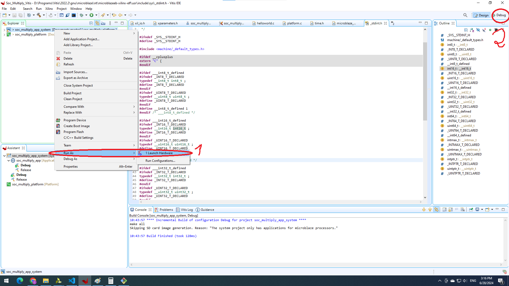

# 1. Struct of reconfigurable multiplication

`Choose mode config`

## 1.1. Register Map with AXI LITE interface

# 2. SoC 

## 2.1. Generate Block Design

- And then Generate Bistream. 
- And then File -> Export -> Export Hardware with bistream.
- And then Tools -> Launch Vitis IDE.

## 2.2. Creat Platform project
- Note: After regenerate bistream in Vivado, let right click on Platform project and choose Update Hardware Specification

## 2.3. Creat Application project
- Built project.

# 3. Run code
## 3.1. On Vivado
- Open Hardware Manager -> Open target -> Program Device.

## 3.2. On Vitis
- Right click on Application Project -> Run As -> Launch Hardware
- And then click Debug window.

- Connect Vitis Serial Terminal. NOTE: Baud Rate must equals UART_LITE in block SoC (Vivado).

